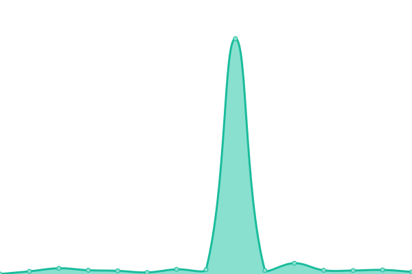

# [📈 Live Status](https://lissy93.github.io/uptime): <!--live status--> **🟩 All systems operational**

This repository uses [Upptime](https://github.com/upptime/upptime) to implement GitHub actions that monitor the status a couple of my applications, mostly lesser used demo applications that do not have their own dedicated monitoring environment.

<!--start: status pages-->
<!-- This summary is generated by Upptime (https://github.com/upptime/upptime) -->
<!-- Do not edit this manually, your changes will be overwritten -->
<!-- prettier-ignore -->
| URL | Status | History | Response Time | Uptime |
| --- | ------ | ------- | ------------- | ------ |
|  [Personal Website](https://aliciasykes.com) | 🟩 Up | [personal-website.yml](https://github.com/Lissy93/uptime/commits/HEAD/history/personal-website.yml) | 

 225ms
     
 | 

<a href="https://lissy93.github.io/uptime/history/personal-website">100.00%</a>
    

|  [Sentiment Sweep](https://sentiment-sweep.com) | 🟩 Up | [sentiment-sweep.yml](https://github.com/Lissy93/uptime/commits/HEAD/history/sentiment-sweep.yml) | 

 832ms
     
 | 

<a href="https://lissy93.github.io/uptime/history/sentiment-sweep">100.00%</a>
    

|  [Security List](https://security-list.js.org) | 🟩 Up | [security-list.yml](https://github.com/Lissy93/uptime/commits/HEAD/history/security-list.yml) | 

 156ms
     
 | 

<a href="https://lissy93.github.io/uptime/history/security-list">100.00%</a>
    

|  [Demo - Dashy](https://dashy-demo-2.as93.net) | 🟩 Up | [demo-dashy.yml](https://github.com/Lissy93/uptime/commits/HEAD/history/demo-dashy.yml) | 

 139ms
     
 | 

<a href="https://lissy93.github.io/uptime/history/demo-dashy">100.00%</a>
    

|  [Demo- Happy App](http://happy-app-demo.as93.net) | 🟩 Up | [demo-happy-app.yml](https://github.com/Lissy93/uptime/commits/HEAD/history/demo-happy-app.yml) | 

 193ms
     
 | 

<a href="https://lissy93.github.io/uptime/history/demo-happy-app">100.00%</a>
    

|  [Demo - Lift Dash](https://tfl-lift-dash.as93.net) | 🟩 Up | [demo-lift-dash.yml](https://github.com/Lissy93/uptime/commits/HEAD/history/demo-lift-dash.yml) | 

 174ms
     
 | 

<a href="https://lissy93.github.io/uptime/history/demo-lift-dash">100.00%</a>
    

|  [Revision Quizzes](https://revisionquizzes.com) | 🟩 Up | [revision-quizzes.yml](https://github.com/Lissy93/uptime/commits/HEAD/history/revision-quizzes.yml) | 

 350ms
     
 | 

<a href="https://lissy93.github.io/uptime/history/revision-quizzes">100.00%</a>
    

|  [Reference - TCP ping](1.1.1.1) | 🟩 Up | [reference-tcp-ping.yml](https://github.com/Lissy93/uptime/commits/HEAD/history/reference-tcp-ping.yml) | 

 67ms
     
 | 

<a href="https://lissy93.github.io/uptime/history/reference-tcp-ping">100.00%</a>
    

<!--end: status pages-->

[**Visit the status website →**](https://lissy93.github.io/uptime)

## 📄 License

- Powered by: [Upptime](https://github.com/upptime/upptime)
- Code: [MIT](./LICENSE) © [Alicia Sykes](https://aliciasykes.com)
- Data in the `./history` directory: [Open Database License](https://opendatacommons.org/licenses/odbl/1-0/)
