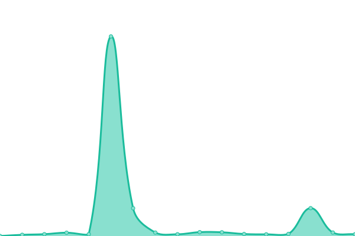

# [📈 Live Status](https://lissy93.github.io/uptime): <!--live status--> **🟧 Partial outage**

This repository uses [Upptime](https://github.com/upptime/upptime) to implement GitHub actions that monitor the status a couple of my applications, mostly lesser used demo applications that do not have their own dedicated monitoring environment.

<!--start: status pages-->
<!-- This summary is generated by Upptime (https://github.com/upptime/upptime) -->
<!-- Do not edit this manually, your changes will be overwritten -->
<!-- prettier-ignore -->
| URL | Status | History | Response Time | Uptime |
| --- | ------ | ------- | ------------- | ------ |
|  [Awesome Privacy](https://awesome-privacy.xyz) | 🟥 Down | [awesome-privacy.yml](https://github.com/Lissy93/uptime/commits/HEAD/history/awesome-privacy.yml) | 

 172ms
     
 | 

<a href="https://lissy93.github.io/uptime/history/awesome-privacy">58.58%</a>
    

|  [Go-APOD](https://apod.as93.net/) | 🟩 Up | [go-apod.yml](https://github.com/Lissy93/uptime/commits/HEAD/history/go-apod.yml) | 

 410ms
     
 | 

<a href="https://lissy93.github.io/uptime/history/go-apod">100.00%</a>
    

|  [Email Comparison](https://email-comparison.as93.net) | 🟩 Up | [email-comparison.yml](https://github.com/Lissy93/uptime/commits/HEAD/history/email-comparison.yml) | 

 226ms
     
 | 

<a href="https://lissy93.github.io/uptime/history/email-comparison">89.32%</a>
    

|  [Dashy Docs](https://dashy.to) | 🟩 Up | [dashy-docs.yml](https://github.com/Lissy93/uptime/commits/HEAD/history/dashy-docs.yml) | 

 268ms
     
 | 

<a href="https://lissy93.github.io/uptime/history/dashy-docs">100.00%</a>
    

|  [Countries](https://countries.as93.net) | 🟩 Up | [countries.yml](https://github.com/Lissy93/uptime/commits/HEAD/history/countries.yml) | 

 590ms
     
 | 

<a href="https://lissy93.github.io/uptime/history/countries">100.00%</a>
    

|  [Cyber Presentation](https://cyber-presentation.as93.net) | 🟩 Up | [cyber-presentation.yml](https://github.com/Lissy93/uptime/commits/HEAD/history/cyber-presentation.yml) | 

 503ms
     
 | 

<a href="https://lissy93.github.io/uptime/history/cyber-presentation">100.00%</a>
    

|  [AliciaSykes.com](https://aliciasykes.com) | 🟩 Up | [alicia-sykes-com.yml](https://github.com/Lissy93/uptime/commits/HEAD/history/alicia-sykes-com.yml) | 

 265ms
     
 | 

<a href="https://lissy93.github.io/uptime/history/alicia-sykes-com">100.00%</a>
    

|  [Sentiment Sweep](https://sentiment-sweep.com) | 🟩 Up | [sentiment-sweep.yml](https://github.com/Lissy93/uptime/commits/HEAD/history/sentiment-sweep.yml) | 

 1078ms
     
 | 

<a href="https://lissy93.github.io/uptime/history/sentiment-sweep">100.00%</a>
    

|  [Security List](https://security-list.js.org) | 🟩 Up | [security-list.yml](https://github.com/Lissy93/uptime/commits/HEAD/history/security-list.yml) | 

 226ms
     
 | 

<a href="https://lissy93.github.io/uptime/history/security-list">100.00%</a>
    

|  [Demo - Dashy](https://dashy-demo-2.as93.net) | 🟩 Up | [demo-dashy.yml](https://github.com/Lissy93/uptime/commits/HEAD/history/demo-dashy.yml) | 

 910ms
     
 | 

<a href="https://lissy93.github.io/uptime/history/demo-dashy">99.82%</a>
    

|  [Demo- Happy App](http://happy-app-demo.as93.net) | 🟩 Up | [demo-happy-app.yml](https://github.com/Lissy93/uptime/commits/HEAD/history/demo-happy-app.yml) | 

 218ms
     
 | 

<a href="https://lissy93.github.io/uptime/history/demo-happy-app">100.00%</a>
    

|  [Demo - Lift Dash](https://tfl-lift-dash.as93.net) | 🟩 Up | [demo-lift-dash.yml](https://github.com/Lissy93/uptime/commits/HEAD/history/demo-lift-dash.yml) | 

 919ms
     
 | 

<a href="https://lissy93.github.io/uptime/history/demo-lift-dash">99.82%</a>
    

|  [Revision Quizzes](https://revisionquizzes.com) | 🟩 Up | [revision-quizzes.yml](https://github.com/Lissy93/uptime/commits/HEAD/history/revision-quizzes.yml) | 

 411ms
     
 | 

<a href="https://lissy93.github.io/uptime/history/revision-quizzes">100.00%</a>
    

|  [Email Extractor](https://email-extractor.as93.net) | 🟩 Up | [email-extractor.yml](https://github.com/Lissy93/uptime/commits/HEAD/history/email-extractor.yml) | 

 199ms
     
 | 

<a href="https://lissy93.github.io/uptime/history/email-extractor">100.00%</a>
    

|  [AHK to Espanso](http://ahk-to-espanso.as93.net) | 🟩 Up | [ahk-to-espanso.yml](https://github.com/Lissy93/uptime/commits/HEAD/history/ahk-to-espanso.yml) | 

 779ms
     
 | 

<a href="https://lissy93.github.io/uptime/history/ahk-to-espanso">100.00%</a>
    

|  [Bullet Convertor](http://bullet-convertor.as93.net) | 🟩 Up | [bullet-convertor.yml](https://github.com/Lissy93/uptime/commits/HEAD/history/bullet-convertor.yml) | 

 1668ms
     
 | 

<a href="https://lissy93.github.io/uptime/history/bullet-convertor">100.00%</a>
    

|  [Tic-Tac-Toe](http://tic-tac-toe.as93.net) | 🟩 Up | [tic-tac-toe.yml](https://github.com/Lissy93/uptime/commits/HEAD/history/tic-tac-toe.yml) | 

 489ms
     
 | 

<a href="https://lissy93.github.io/uptime/history/tic-tac-toe">100.00%</a>
    

|  [Reference - TCP ping](1.1.1.1) | 🟩 Up | [reference-tcp-ping.yml](https://github.com/Lissy93/uptime/commits/HEAD/history/reference-tcp-ping.yml) | 

 69ms
     
 | 

<a href="https://lissy93.github.io/uptime/history/reference-tcp-ping">100.00%</a>
    

<!--end: status pages-->

[**Visit the status website →**](https://lissy93.github.io/uptime)

## 📄 License

- Powered by: [Upptime](https://github.com/upptime/upptime)
- Code: [MIT](./LICENSE) © [Alicia Sykes](https://aliciasykes.com)
- Data in the `./history` directory: [Open Database License](https://opendatacommons.org/licenses/odbl/1-0/)
